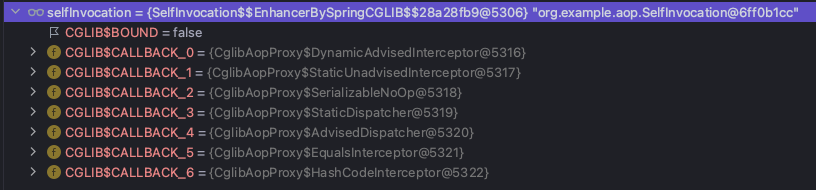
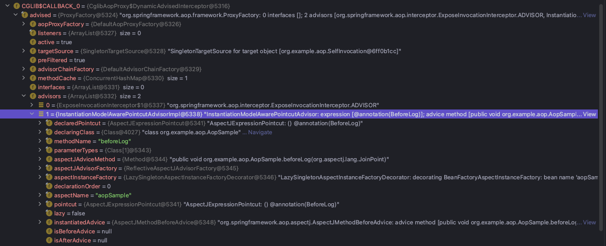
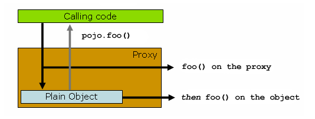

리드님이 작은 과제를 하나 주셨다.
문제가 있는 코드였는데, 간단히 설명하면 스케줄링 코드에서 캐시 업데이트 하는 메서드를 호출하는데, 메서드는 호출되지만 캐시 업데이트가 일어나지 않았다.

결과적으론 self-invocation의 문제였고, 재밌게 공부했기에 내용을 정리해본다.

# Spring AOP란

해당 글은 aop에 대한 설명보단 self-invocation에 대한 내용에 힘을 실었기에 가볍게 설명하자.

AOP는 관점 지향 프로그래밍으로 각각 흩어져있는 관심사(crosscutting concerns)를 모듈화하여 비즈니스 로직에서 분리 후, 재사용성을 높여 유지보수성을 증대시키는 프로그래밍 기법이다.

가장 흔하게 드는 예제로 여러 메소드에 시간을 측정하는 로직을 하드 코딩으로 넣었다고 생각해보자

```java
        void add(int a, int b) {
            long start = System.currentTimeMillis();
            // 다양한 비즈니스 로직
            long end = System.currentTimeMillis();
            log.info("총 소요 시간은 {}ms 입니다.", end - start);
        }
```

만약 여기서 시간 측정 단위가 ms가 아닌 sec로 해달라는 요구사항이 생겼다면 어떻게 할 수 있을까?
존재하는 모든 메서드에서 로깅 코드를 변경하면 된다.

하나, 둘, 셋 .... 언제까지 이런 식의 반복 작업을 할 순 없다.

이러한 상황에서 비즈니스 로직에 시간 측정이라는 관심사를 분리하여 관리하는 것이 AOP이다.

AOP는 특정한 상황(PointCut)에 원하는 관심 로직(advice)를 실행하도록 손쉽게 만들 수 있다.

더 깊은 내용은 aop 관련하여 잘 정리된 포스팅이 많으니 참고하면 좋을 것 같다.

# Self-Invocation

간단히 설명하면, 동일한 A클래스에서 B메서드가 C메서드를 호출한 상황을 말한다.
이러한 상황에서 C메서드에 걸려있는 AOP는 작동하지 않는다. (별개의 조치를 취하지 않았다면)

예제로 쓰인 코드는 아래와 같다.

```java
// BeforeLog.class
public @interface BeforeLog {
}

//AopSample.class
@Aspect
@Component
@Slf4j
public class AopSample {

    @Before("@annotation(BeforeLog)")
    public void beforeLog(JoinPoint joinPoint) {
        log.info("beforeLog : {}", joinPoint.getSignature().getName());
    }
}

```

```java
//SelfInvocation.calss
@Slf4j
@Component
public class SelfInvocation {

    @BeforeLog
    public void selfInvocationCall() {
        log.info("call selfInvocation");
        this.method1();
    }

    @BeforeLog
    public void method1() {
        log.info("call method 1");
    }

    @BeforeLog
    public void method2() {
        log.info("call method 2");
    }

}
```

```java
    @Test
    void logTest() {
        selfInvocation.method1();
        selfInvocation.method2();
    }
```

해당 테스트를 돌리면 method 1, 2에 대해 모두 aop가 작동한다.

```java
2022-11-19 01:06:03.857  INFO 10318 --- [           main] org.example.aop.AopSample                : beforeLog : method1
2022-11-19 01:06:03.886  INFO 10318 --- [           main] org.example.aop.SelfInvocation           : call method 1
2022-11-19 01:06:03.886  INFO 10318 --- [           main] org.example.aop.AopSample                : beforeLog : method2
2022-11-19 01:06:03.886  INFO 10318 --- [           main] org.example.aop.SelfInvocation           : call method 2
```

하지만, self-invocation 상황을 만들어 호출하면 어떻게 될까?

```java
    @Test
    void selfInvocationTest() {
        selfInvocation.selfInvocationCall();
    }
```

결과는 아래와 같다.

```java
2022-11-19 01:11:32.627  INFO 15719 --- [           main] org.example.aop.AopSample                : beforeLog : selfInvocationCall
2022-11-19 01:11:32.652  INFO 15719 --- [           main] org.example.aop.SelfInvocation           : call selfInvocation
2022-11-19 01:11:32.653  INFO 15719 --- [           main] org.example.aop.SelfInvocation           : call method 1

```

두둥..

method1에 대해 aop가 작동하지 않았다!!

이것이 리드님이 말씀해주신 문제 상황이다.

## Self-Invocaiton과 AOP의 관계

Spring에서 AOP를 구현하는 모습을 살펴보면 처음 빈을 생성하는 과정에서 real-subject가 아닌 proxy 빈을 생성하여 주입한다.



즉, 우리는 프록시 빈을 실제 빈처럼 사용하지만, 내부적으로는 우선 프록시 빈에서 aop adviser를 통해 각각 pointcut에 대한 advice를 실행하며 실제 real-subject의 비즈니스 로직을 수행하는 것이다.



내부 객체를 까보면 우리가 선언한 aspect와 advice를 볼 수 있다.

큰 실행의 흐름을 정리하면 아래와 같다.

```
클라이언트가 A 서비스를 호출한다
==
클라이언트 - A 서비스의 프록시 - (존재한다면) advice 수행 - real-subject method 수행 - (존재한다면) advice 수행
```

여기서 가장 중요한 것은 이 advice를 수행하려면 실행의 주체가 proxy가 되야 한다는 점이다.

왜냐하면 advisor, advice 등등의 정보는 해당 Proxy 클래스가 들고 있기 때문이다.

그렇다면 이제 문제가 됐던 로직의 원인이 감이 올 수 있다.

self-invocation인 상황에서 outer method에서 inner method를 호출하면, inner method는 누가 수행할까?

proxy class일까, real-subject일까?

정답은 후자(real-subject)이다.



이미 외부 요청을 통해 outer method로 들어왔다는 사실은 proxy를 거치고 real-subject의 outer method로 도달했다는 말이다.

이미 real-subject까지 도달했기에 inner method한테는 애초에 proxy 로직을 건들일 기회조차 주어지지 않는다. 이게 원인이다.

[Google Code Self-Invocation](https://code.google.com/archive/p/ehcache-spring-annotations/wikis/UsingCacheable.wiki)를 따르면 위와 같은 상황을 아래와 같이 표현한다.

```
Self-Invocation
Only external method calls coming in through the proxy are intercepted. This means that self-invocation, in effect, a method within the target object calling another method of the target object, will not lead to an actual cache interception at runtime even if the invoked method is marked with @Cacheable.

프록시를 통해 들어오는 외부 메서드 호출만 가로챕니다. 즉, 대상 객체의 다른 메서드를 호출하는 객체 내 자체 호출은 호출된 메서드가 @Cacheable로 표시되더라도 런타임 시 실제 캐시 가로채기로 이어지지 않습니다.
```

@Cacheable은 캐시가 존재하면 내부 메서드를 통하지 않고 값을 바로 반환하고, 캐시가 없다면 내부 로직을 통해 나온 값을 캐시에 저장하는 역할을 한다. 해당 역할을 수행할 때 AOP를 사용한다.

이번 시간에는 이렇게 aop와 self-invocation의 관계까지만 알아보고 약 세 가지의 해결책은 다음 포스팅으로 알아보자.

---

누군가 이 글을 읽고 의문이나 잘못된 점이 있다면 언제든 댓글로 알려주시길 바랄게요 :)

감사합니다.

사담이지만 처음 포스팅을 해서 그런지 한번 정리한 내용임에도 시간이 약 1시간 반이 소요됐다. 다른 분들은 이러한 글을 작성할 때 얼마나 걸리실 지 궁금하긴하다.
